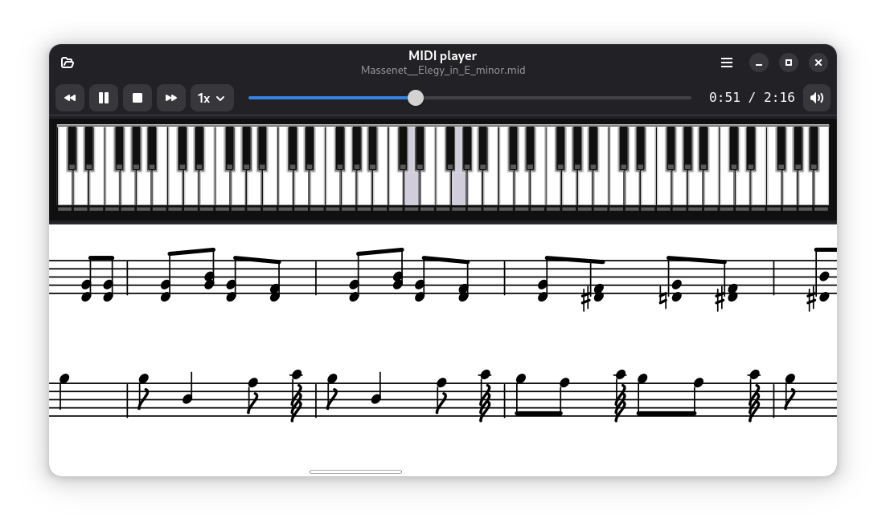

<p align="center">
  
</p>

<h1 align="center">MIDI player</h1>

A native GNOME MIDI player with a piano keyboard and scrolling note
sheet display. Inspired by classic MIDI players from the Windows 3.11 era,
rebuilt for modern Linux with GTK4, libadwaita, Cairo, and FluidSynth.

<p align="center">
  
</p>

**Features:**

- Scrolling sheet music with treble and bass clef, key signatures,
  beamed notes, accidentals, rests, and measure bars
- Full piano keyboard with real-time note highlighting
- FluidSynth audio synthesis via PipeWire / PulseAudio / ALSA
- Playback controls: play, pause, stop, rewind, fast-forward
- Speed control and volume with popover sliders
- Timeline scrubbing with time display
- Mouse scroll zoom on the note sheet
- Auto-zoom to fit window width (including fullscreen)
- 30-second time markers on the score
- Opens `.mid` files from the GNOME file manager
- Dark/light theme support via libadwaita
- Recent files menu

## Install from .deb

Download the latest `.deb` from the
[releases page](https://github.com/pulpoff/midiplayer/releases) and install:

```sh
sudo dpkg -i midiplayer_0.1.2_all.deb
sudo apt-get install -f   # pulls in any missing dependencies
```

Then launch from the GNOME app launcher or terminal:

```sh
midiplayer [file.mid]
```

To build the `.deb` yourself from source:

```sh
git clone https://github.com/pulpoff/midiplayer.git
cd midiplayer
./build-deb.sh
```

## Running from source

```sh
./build.sh              # install deps + launch
./build.sh file.mid     # install deps + open file
./build.sh --run        # launch only (skip dep check)
```

Dependencies (installed automatically by `build.sh`):

```
python3 python3-gi python3-gi-cairo gir1.2-gtk-4.0 gir1.2-adw-1
fluidsynth libfluidsynth3 fluid-soundfont-gm pyfluidsynth (pip)
```

## Keyboard shortcuts

| Key | Action |
|-----|--------|
| `+` / `=` / `Ctrl+=` | Zoom in |
| `-` / `Ctrl+-` | Zoom out |
| `0` / `Ctrl+0` | Reset zoom |
| `Ctrl+O` | Open file |
| `Ctrl+W` | Close file |
| `Ctrl+Q` | Quit |
| Mouse scroll | Zoom in/out on sheet |

## Credits

Inspired by Madhav Vaidyanathan's
[MidiSheetMusic](http://midisheetmusic.com/) 2.6 (GPLv2).
Licensed under GPLv2.
